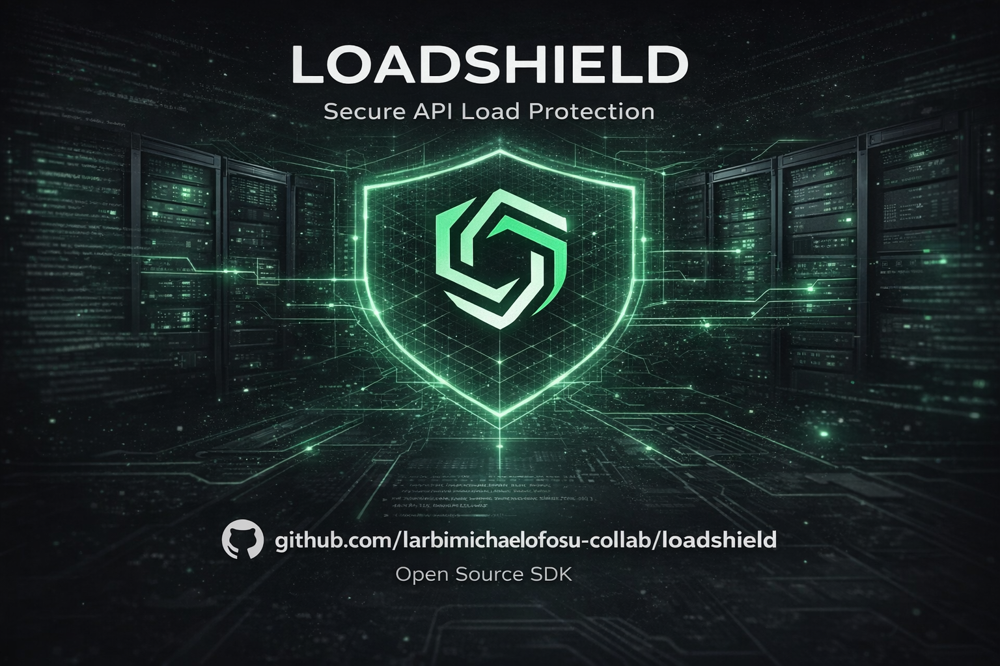

# LoadShield

<p align="center">
  
</p>

LoadShield is a smart traffic-control gateway that protects backend APIs from overload, abusive traffic, and request spikes using rate limiting, throttling, caching, and abuse detection.

This repo is a runnable, batteries-included demo with:
- A deliberately fragile backend API (`apps/backend`) that overloads under spikes
- A LoadShield gateway (`apps/loadshield`) that rate-limits, throttles, and bans abuse
- A live dashboard at `http://localhost:4000` (or your deployed URL) showing allowed vs blocked traffic
- A cache layer in LoadShield that can serve hot data fast and reduce backend load

This is a demo meant for learning and presentations, not a hardened production gateway.

## How It Works (1-minute mental model)

```
Browser / Script
   |
   v
LoadShield (port 4000)  --->  Backend API (port 4001)
   |
   +-- Dashboard: GET /metrics
   +-- Caching: read-through for GET /api/*
   +-- Rules: rate limit + throttle + temp bans
```

If you want a diagram GitHub renders:

```mermaid
flowchart LR
  C[Client] -->|/api/*| LS[LoadShield :4000]
  LS -->|proxy| BE[Backend :4001]
  C -->|Dashboard| LS
  LS -->|/metrics| C
  LS -->|cache store (memory/redis/file)| CS[(Cache)]
```

## Quick Start

### Prerequisites

- Node.js `>= 18` (Node 20 recommended)
- npm (comes with Node)
- Optional for Redis mode: Docker Desktop (or a local Redis)

### Run It

1. Install deps:
   - `npm install`
2. Start both servers (gateway + backend):
   - `npm run dev`
3. Open the dashboard:
   - `http://localhost:4000` (or your deployed URL)

If PowerShell blocks `npm` with "running scripts is disabled", use `npm.cmd` instead (example: `npm.cmd run dev`).

Ports:
- Backend: `http://localhost:4001`
- LoadShield: `http://localhost:4000` (proxies `/api/*` to backend)

### Smoke Test

- `GET http://localhost:4000/health` → `{ ok: true }` (replace `localhost:4000` with your deployed host if needed)
- `GET http://localhost:4000/api/hello` → proxied to backend (see backend routes)
- `GET http://localhost:4000/metrics` → dashboard data

## Publish to GitHub (Repo)

If you just want this demo in a GitHub repo:

1. Initialize git (only once):
   - `git init`
   - `git add -A`
   - `git commit -m "Initial commit"`
2. Create a new repo on GitHub, then add the remote and push:
   - `git branch -M main`
   - `git remote add origin <YOUR_GITHUB_REPO_URL>`
   - `git push -u origin main`

This repo already ignores `node_modules/` and `.env`. It also ignores any runtime cache folders (`**/.cache/`).

## The Killer "Before vs After"

1. Traffic spike without LoadShield (hit backend directly):
   - `npm run spike:direct -- --rps 500 --seconds 15`
2. Same spike with LoadShield on (hit the gateway):
   - `npm run spike:shield -- --rps 500 --seconds 15`

Watch:
- Direct backend: lots of `503 backend_overloaded`, latency climbs
- Behind LoadShield: `429 rate_limited` and `403 banned` show up, but backend stays alive

Tip: You can change intensity:
- `--rps 50 --seconds 10` (gentle)
- `--rps 800 --seconds 20` (aggressive)

## Demo Features Implemented

- Rate limiting: default `100 req/min` per user (`x-user-id`) or per IP
- Traffic throttling: adds delay when inbound RPS is high instead of crashing the backend
- Abuse detection: too many `POST /api/login` attempts in 10s triggers a temporary ban
- Dashboard: polls `/metrics` for totals + a requests/sec timeline
- Caching: auto-cache GET `/api/*` and optional admin endpoints to push/invalidate cache

## What To Show In A Demo

1. Open the dashboard: `http://localhost:4000` (or your deployed URL)
2. Run `npm run spike:direct -- --rps 500 --seconds 15` and show backend pain
3. Run `npm run spike:shield -- --rps 500 --seconds 15` and show backend survival
4. Refresh a GET endpoint repeatedly and show cache HIT/MISS (`x-loadshield-cache` header)

## Using A Domain / Non-Localhost

`localhost` is perfect for local development (everyone’s machine has it).

If you deploy this somewhere, you’ll use your host/domain instead of `localhost`, and you’ll usually:
- Put LoadShield behind `https://your-domain.com` (port 443) using a reverse proxy (e.g., Nginx/Caddy) or your platform’s routing
- Configure where LoadShield forwards traffic by setting `BACKEND_URL` (example: `https://api.your-domain.com`)

You can also change ports with:
- `LOADSHIELD_PORT` (default `4000`)
- `BACKEND_PORT` (default `4001`)

## Optional: Redis (More "Real")

The demo works without Redis (in-memory store), but supports Redis if you set `REDIS_URL`.

1. Start Redis:
   - `docker compose up -d`
2. Start demo with Redis:
   - PowerShell: `$env:REDIS_URL="redis://localhost:6379"; npm run dev`
   - macOS/Linux: `REDIS_URL="redis://localhost:6379" npm run dev`

## "Final Version" Cache Behavior

LoadShield supports two ways to get cached data:
- Automatic caching (read-through): LoadShield fetches from upstream (`BACKEND_URL`) and caches GET `/api/*`
- Manual push (write-through): your app pushes the values you want cached via admin endpoints

And you can choose where cached data lives:
- In-memory (default)
- Redis (`REDIS_URL` or `LS_CACHE_REDIS_URL`)
- File cache directory (`LS_CACHE_STORE=file` and optional `LS_CACHE_DIR=...`)

### Admin Cache API (Push/Invalidate)

If you set `LS_ADMIN_TOKEN`, include it as `x-loadshield-admin-token: ...`.

- `PUT /admin/cache` body: `{ "key": "...", "value": <string|json>, "ttlSeconds": 10 }`
- `GET /admin/cache?key=...` (returns raw cached payload)
- `DELETE /admin/cache?key=...` (or JSON body `{ "key": "..." }`)

Security note: if `LS_ADMIN_TOKEN` is not set, admin endpoints are open (demo convenience). Set it for any shared environment.

### "Table Names In The API" (Demo Mode)

For the demo, LoadShield can serve "tables" directly from JSON files (standing in for a real DB adapter).

1. Enable tables:
   - PowerShell: `$env:LS_TABLES="users"; npm run dev`
   - macOS/Linux: `LS_TABLES="users" npm run dev`
2. Try:
   - `GET http://localhost:4000/data/users`
   - `GET http://localhost:4000/data/users/1`

The sample table lives at `apps/loadshield/data/users.json`.

## Useful Env Vars

- `BACKEND_PORT` (default `4001`)
- `BACKEND_MAX_INFLIGHT` (default `50`)
- `LOADSHIELD_PORT` (default `4000`)
- `BACKEND_URL` (default `http://localhost:4001`)
- `LS_RATE_LIMIT_PER_MIN` (default `100`)
- `LS_THROTTLE_SOFT_RPS` (default `120`)
- `LS_THROTTLE_HARD_RPS` (default `240`)
- `LS_LOGIN_ABUSE_LIMIT_10S` (default `30`)
- `LS_BAN_SECONDS` (default `600`)
- `LS_CACHE_ENABLED` (`1` or `0`, default `1`)
- `LS_CACHE_TTL_SECONDS` (default `8`)
- `LS_CACHE_PREFIX` (default `cache`)
- `LS_CACHE_VARY_USER` (`1` or `0`, default `0`)
- `LS_CACHE_STORE` (`memory`, `redis`, or `file`)
- `LS_CACHE_REDIS_URL` (optional override for cache Redis)
- `LS_CACHE_DIR` (file cache directory)
- `LS_ADMIN_TOKEN` (protects `/admin/*` when set)
- `LS_TABLES` (comma-separated list of table names to serve via `/data/:table`)
- `LS_TABLE_DATA_DIR` (directory holding `<table>.json` files)

## Troubleshooting

- PowerShell says scripts are disabled:
  - Use `npm.cmd run dev` (or change your execution policy if you know what you’re doing).
- Port already in use:
  - Set `LOADSHIELD_PORT` and/or `BACKEND_PORT` to free ports.
- You set `REDIS_URL` but it still says it’s using memory:
  - Ensure Redis is reachable and `docker compose up -d` is running.

## Author

Michael Kwame Ofosu Larbi

LoadShield was built as a demonstration of an API traffic-control gateway designed to protect backend services from overload using rate limiting, traffic throttling, caching, and abuse detection.
